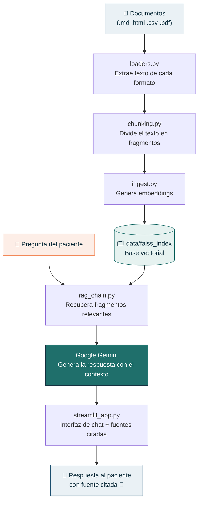

# 🦷 Agente de IA — Clínica Dental Sonrisa Plena

Agente conversacional (RAG — Retrieval-Augmented Generation) que responde
preguntas de pacientes basándose **únicamente** en la documentación oficial
de una clínica dental ficticia. Proyecto desarrollado para el Challenge
Alura — Agentes de IA Corporativos.

**🔗 App en vivo:** (https://challenge-alura-bgi2qqgtsnvtnujyew3yrr.streamlit.app)

---

## 1. Descripción general del proyecto

En vez de que el agente busque respuestas en su conocimiento general (lo
que puede llevar a inventar información, o "alucinar"), este agente
**solo responde con base en 4 documentos reales de la clínica** —
política de privacidad, FAQ de citas, FAQ general y tarifario de
servicios. Si la pregunta no puede responderse con esos documentos, el
agente lo indica explícitamente en vez de inventar una respuesta.

Además, incluye una función para que cualquier colaborador de la clínica
pueda **subir nuevos documentos** (.md, .html, .csv, .pdf) directamente
desde la interfaz, ampliando la base de conocimiento del agente sin tocar
código.

## 2. Arquitectura de la solución implementada

El proyecto sigue el patrón estándar de **RAG**: los documentos se
convierten en vectores numéricos (embeddings) y se guardan en una base
vectorial; cuando el paciente pregunta algo, se recuperan solo los
fragmentos relevantes y se le pasan al modelo de lenguaje como contexto
para que redacte la respuesta.



Cada respuesta muestra de qué documento salió la información (📎 fuente
citada), para que el paciente —y quien evalúe el proyecto— pueda verificar
que el agente no está inventando nada.

## 3. Tecnologías y herramientas utilizadas

| Componente | Herramienta |
|---|---|
| Lenguaje | Python |
| Framework RAG | LangChain |
| Embeddings | `sentence-transformers/all-MiniLM-L6-v2` (Hugging Face, local) |
| Vector store | FAISS |
| LLM | Google Gemini (`gemini-3.5-flash`) |
| Interfaz | Streamlit |
| Despliegue | Streamlit Community Cloud |

## 4. Instrucciones para ejecutar el proyecto

### Localmente

1. Clona el repositorio e instala dependencias:
   ```
   pip install -r requirements.txt
   ```
2. Copia `.env.example` a `.env` y coloca tu API key de Google Gemini
   ([consíguela gratis aquí](https://aistudio.google.com/)).
3. Construye el índice vectorial (solo la primera vez, o si cambian los documentos):
   ```
   cd app
   python ingest.py
   ```
4. Levanta la interfaz:
   ```
   streamlit run streamlit_app.py
   ```

### En la nube (Streamlit Community Cloud)

Desplegado en **Streamlit Community Cloud** (no requiere tarjeta de
crédito, solo una cuenta de GitHub).

1. Sube el repositorio a GitHub, **incluyendo el índice ya construido**
   (`data/faiss_index/index.faiss` y `index.pkl`), aunque normalmente
   estén en `.gitignore`:
   ```
   git add -f data/faiss_index/index.faiss data/faiss_index/index.pkl
   git add .
   git commit -m "Preparar despliegue"
   git push
   ```
2. Ve a [share.streamlit.io](https://share.streamlit.io) e inicia sesión con tu cuenta de GitHub.
3. **"Create app"** → elige el repositorio, la rama (`main`) y como
   *Main file path*: `app/streamlit_app.py`
4. En **"Advanced settings" → Secrets**, agrega (formato TOML, con comillas):
   ```toml
   GOOGLE_API_KEY = "tu_api_key_aqui"
   ```
5. **Deploy**. La primera vez tarda unos minutos mientras instala
   `requirements.txt` y descarga el modelo de embeddings.

> Nota: si agregas documentos nuevos más adelante, usa la sección
> "Agregar documentación" dentro de la propia interfaz — reconstruye el
> índice automáticamente, sin tocar código.

## 5. Ejemplos de preguntas que el agente puede responder

- ¿Cuánto cuesta una limpieza dental?
- ¿Cómo agendo una cita?
- ¿Qué hacen con mis datos personales?
- ¿Atienden los sábados?
- ¿Qué especialidades ofrecen?
- ¿Cuánto tiempo antes debo llegar a mi cita?
- ¿Puedo cancelar mi cita sin costo?
- ¿Qué necesito traer a mi primera consulta?

## 6. Ejemplos de respuestas generadas por el agente


## 🎥 Video de demostración

[](https://youtu.be/nzprnvg6r_c)

---

## Estructura del proyecto

```
agente-clinica-dental/
├── app/
│   ├── loaders.py         # Carga PDF, Markdown, HTML y CSV
│   ├── chunking.py        # Divide los documentos en fragmentos
│   ├── ingest.py           # Construye el índice FAISS (ejecutar una vez)
│   ├── rag_chain.py        # Recuperación + generación con Gemini
│   └── streamlit_app.py    # Interfaz web
├── data/
│   ├── documentos/         # Los documentos fuente
│   └── faiss_index/        # Índice vectorial (se genera con ingest.py)
├── img/                     # Capturas para este README
├── requirements.txt
├── .env.example
└── README.md
```
